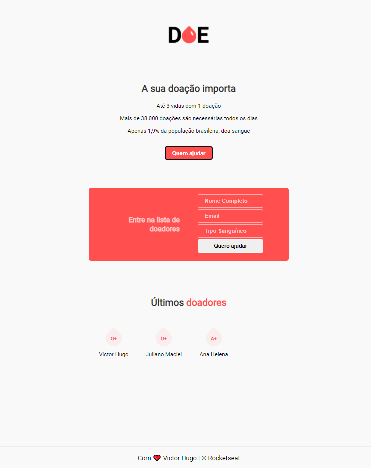

# Blood Donation

[](https://github.com/victorh5/bloodDonation/blob/master/LICENSE)

# Sobre o projeto

Blood Donation é uma aplicação full stack web construída no maratonaDEV3, evento organizado pela [RocketSeat](https://rocketseat.com.br/)

A aplicação consiste em o usuário cadastrar o seu nome, seu email e o tipo sanguíneo. Depois essas informações são enviadas para o banco de dados para que entre em contato com os interessados.

## :rocket: Tecnologias Utilizadas

- [Node](https://nodejs.org/en/)
- [Nodemon](https://nodemon.io/)
- [Nunjucks](https://mozilla.github.io/nunjucks/)
- [PostgreSQL](https://www.postgresql.org/)

## Layout

<p align="center">

</p>

## Como executar o projeto

```bash
# clonar repositório
git clone https://github.com/victorh5/bloodDonation

# instalar dependêmcias
yarn add

# executar o projeto
yarn start

# criar um DB no postgresql
colocar informações de acordo com o banco criado no server.js
```
# Autor

Victor Hugo Maciel de Lima
https://www.linkedin.com/in/victorh5/
